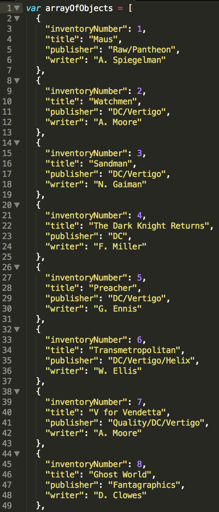
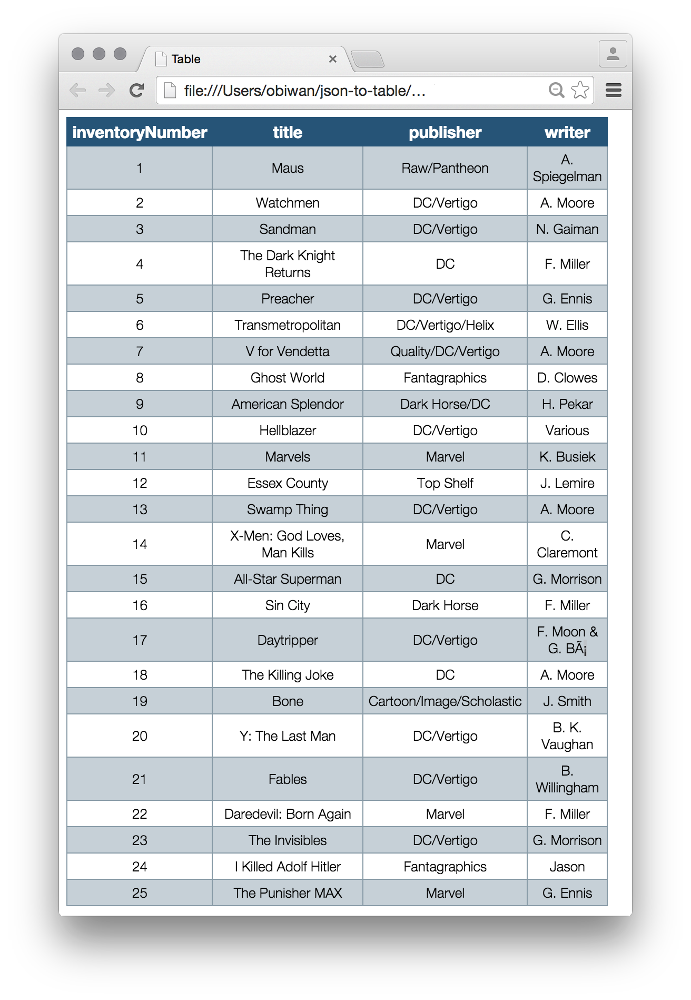

## This utility renders an HTML table representation of an array of objects.

### Schema:
Each object in the array should have the same set of properties, as in, instances of the same "class."  Property names are rendered as columns, and each object in the array is rendered as a row.

#### an array of objects: 

#### rendered as a table:

### TODO:
* 
* 
* 
* 
